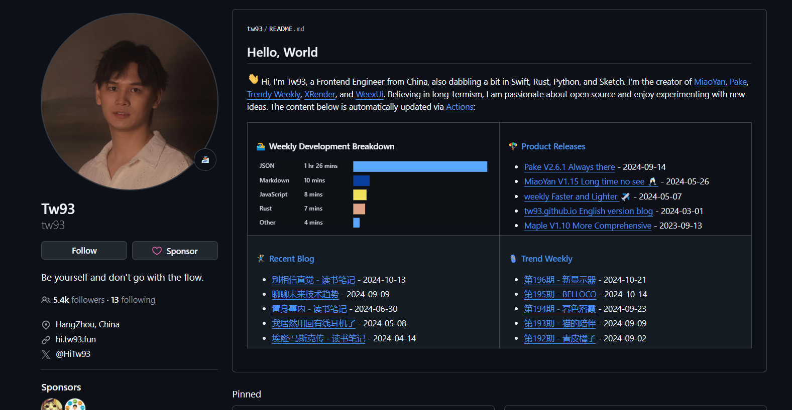

受 [简单简历](https://docs.easycv.cn/guide/content.html) 以及 [tw23的主页](https://github.com/tw93) 的影响，惊叹于设计的美观。



上图是 tw93 的 Github 首页1, 这么简单的一个页面还能玩出花来，而且可以使用 Github Actions 自动生成最新的一系列动态。

给自己的主页增加一点emoji，也许可以带来不一样的色彩。

### 1. 创建 `README.md` 文件

在 GitHub 个人主页仓库中，创建或编辑一个 README\.md 文件。确保仓库名和你的 GitHub 用户名相同，这样 README\.md 文件的内容会自动显示在你的个人页面。

例如：

`https://github.com/your-username/your-username`


### 2. 个人介绍部分 (About Me)

你可以在 `README.md` 中添加个人介绍，类似在截图中看到的内容。以下是一个示例模板：
```
# Hello, World 👋

Hi, I'm [Your Name], a [your role, e.g., Frontend Engineer] from [location or country]. 
I love working with [mention the technologies you work with], and I'm passionate about creating [e.g., open-source projects, tools, apps]. 
I enjoy experimenting with new ideas and sharing my learnings through my projects.

### 💻 Weekly Development Breakdown
<!-- This section can be automated or updated manually, showing what languages or tools you're working with -->

### 🔥 Product Releases
- **Project Name**: Short description - _Release Date_
- **Project Name**: Short description - _Release Date_

### 📝 Recent Blog Posts
- [Post Title](link-to-post) - _Publication Date_
- [Post Title](link-to-post) - _Publication Date_

### 📅 Trend Weekly
- **Week #195**: [Trending topic] - _Date_
- **Week #194**: [Trending topic] - _Date_~
```


### 1. 创建 `README.md` 文件
